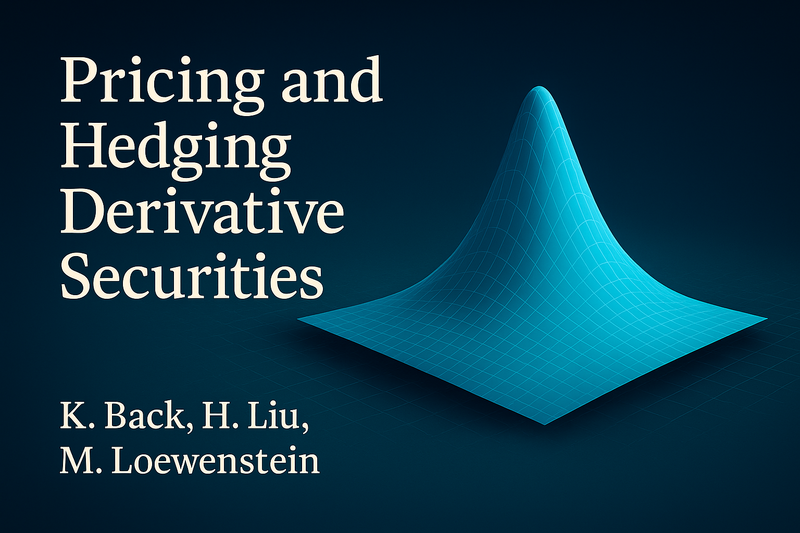
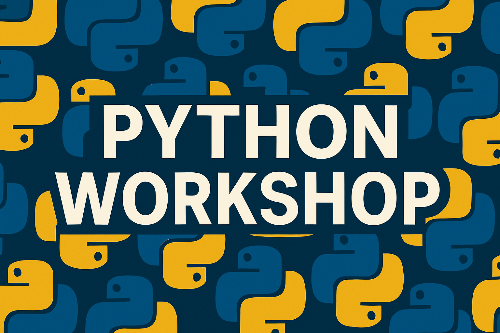

:::: {.columns}

::: {.column width="20%"}

:::
::: {.column width="5%"}
:::
::: {.column width="50%"} 
J. Howard Creekmore Professor of Finance  
Jones Graduate School of Business  
Professor of Economics  
School of Social Sciences 
:::
::: {.column width="20%"}

:::
::::

 

<a href="bi2ai.html" style="color: #71f0e9; text-decoration: none;">New Executive Education Course: From BI to AI &rarr;</a>

 
I teach asset pricing theory to PhD students in the Jones School and the Department of Economics, data-driven finance to students in the Masters of Data Science program in the Department of Computer Science, and generative AI for finance and quantitative investments to MBA students in the Jones School.  I am also currently teaching monthly sections of an online executive education course on agentic AI --- two online sessions per week for four weeks, linked above.
 

Before joining Rice, I served on the faculties of Northwestern University, Indiana University, Washington University in St. Louis, and Texas A&M University.  I served as Senior Associate Dean at the Olin School at Washington University in St. Louis.  I'm a former editor of the Review of Financial Studies, a former editor of Finance & Stochastics, and a former associate editor of the Journal of Finance and various other academic journals in economics and finance.  I've written two textbooks and numerous articles in the leading finance and economics journals.  
 
I served as the Finance Ph.D. Coordinator for the Jones School for 2009 through 2026.  Currently, I serve as the Area Coordinator for the finance faculty group.  Recently, I've been doing research on disclosure policies, security market design, and complexity and momentum in asset pricing.  I've also been advising several strong Ph.D. students.  I received the Financial Management Association Innovation in Teaching Award in two of the past three years, and I also received the Jones Graduate School of Business Ph.D. Mentoring Award in two of the past three years.

:::: {.columns}

::: {.column width="25%"}
[{width=120px}](https://learn-investments.rice-business.org)
:::

::: {.column width="25%"}
[{width=120px}](https://book.derivative-securities.org)
:::

::: {.column width="25%"}
[{width=120px}](https://workshop.kerryback.com)
:::

::: {.column width="25%"}
[{width=120px}](https://data-portal.rice-business.org)
:::

::::
